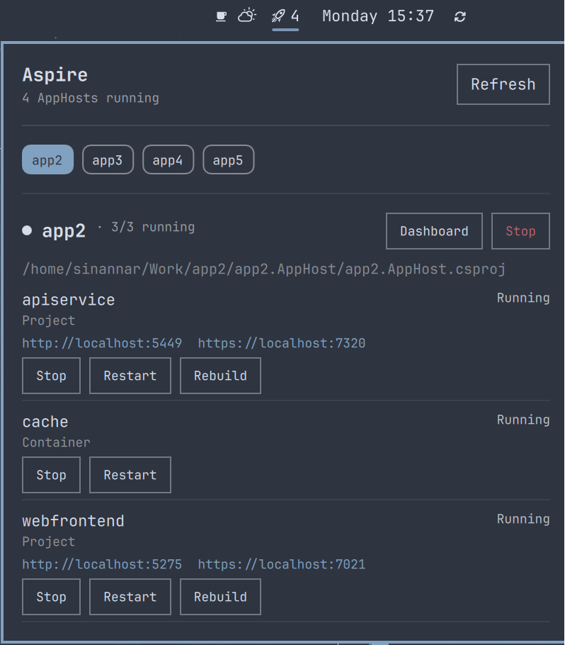
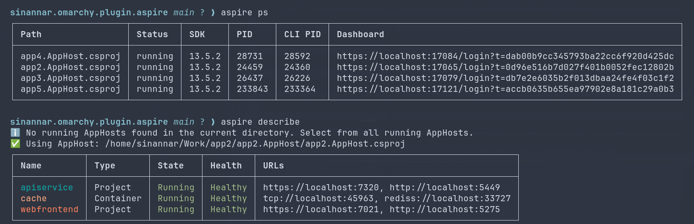
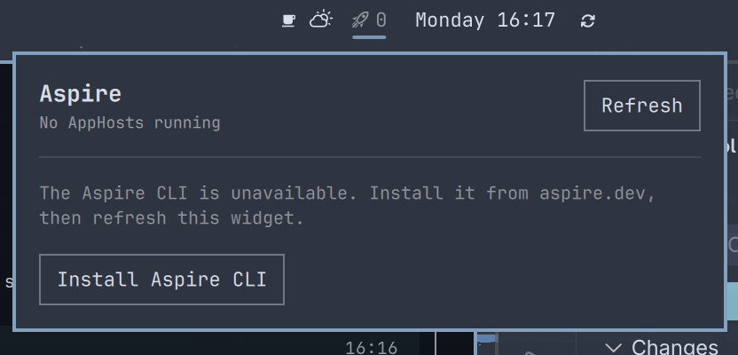

# Aspire

Bar widget and details panel for locally running [Aspire](https://aspire.dev)
AppHosts. The bar shows how many AppHosts `aspire ps` currently reports as
running; the panel lets you pick one of them and see its resources (state,
health, endpoints, and lifecycle commands) with `aspire describe`.

This plugin is a thin, read-mostly wrapper around the Aspire CLI. It never
runs `dotnet` directly and never starts an AppHost — it only observes and
acts on AppHosts that are already running.

## Screenshots

The bar widget shows the number of running AppHosts and opens a details panel
with per-resource state, health, endpoints, and enabled lifecycle commands:



The panel is backed by the same `aspire ps` and `aspire describe` data shown
in the CLI:



When the Aspire CLI is not installed, the panel explains what is missing and
provides an **Install Aspire CLI** button that opens the official
[Aspire website](https://aspire.dev):



## Install

```sh
omarchy plugin add https://github.com/sinannar/sinannar.omarchy.plugin.aspire.git --enable
```

## Usage

Click the Aspire bar widget to open or close the details panel. Press Escape
to close it. The panel lists AppHosts currently reported as `running` by
`aspire ps`; select an AppHost to inspect its resources.

## Configure

Move the widget to a different bar section with:

```sh
omarchy bar move sinannar.omarchy.plugin.aspire --section center
```

See the [Settings](#settings) section for the polling interval.

## Remove

```sh
omarchy plugin remove sinannar.omarchy.plugin.aspire
```

## Dependencies

| Requirement | Why | Install |
|---|---|---|
| [Aspire CLI](https://aspire.dev) (`aspire` on `PATH`) | Every feature shells out to `aspire ps` / `describe` / `stop` / `resource <name> <command>` | `curl -sSL https://aspire.dev/install.sh \| bash`, or `dotnet tool install -g Aspire.Cli` |
| .NET SDK | Required by the Aspire CLI itself to build/run AppHosts | https://dotnet.microsoft.com/download |

The plugin does not install or manage the CLI. If `aspire` is missing, the
bar icon reports "Aspire CLI unavailable — click to retry" instead of a
count, and the panel simply shows no AppHosts.

`PATH` resolution: the widget's own process environment isn't guaranteed to
include every directory an interactive shell would (`~/.dotnet`,
`~/.dotnet/tools`, `~/.local/bin` — the common install locations for the
Aspire CLI). Every CLI invocation appends those to whatever `PATH` it
inherited before running `aspire`, so the CLI resolves the same way it would
from a terminal without requiring shell rc changes.

## Scope

- Only AppHosts `aspire ps` currently reports as `running` are ever shown,
  tracked, or acted on. A stopped AppHost simply disappears from the bar and
  panel on the next poll — it is never remembered, configured, or started
  from here.
- Only one AppHost's resources are fetched at a time: you pick which running
  AppHost to inspect from the panel's chip row, and only that selection
  drives an `aspire describe` call. This keeps the panel responsive with
  many AppHosts running at once instead of polling every one of them.
- Only `http`/`https` endpoints are shown. Other URL schemes (`tcp`,
  `rediss`, `amqp`, …) can carry embedded credentials for some resource
  types, so they are left out of the details panel entirely rather than
  filtered value by value.
- Resource action buttons (Stop / Restart / Rebuild / …) are entirely
  data-driven from whatever Aspire itself reports as `"state": "Enabled"`
  for that resource — never a hardcoded start/stop/restart trio.
- Stopping an AppHost is the one destructive action offered, and it always
  sits behind a confirmation dialog.

## Bar

- Glyph + running AppHost count. Color dims when the CLI is unreachable or
  hasn't polled successfully yet.
- Left click / press: open the panel.
- Middle click: force an immediate `aspire ps` refresh.
- The widget only occupies bar space once there is something to show (a
  running AppHost, or a failed poll worth flagging) — matching how other
  data-driven widgets in this bar collapse out when idle.

## Panel

- **Chip row** — one chip per running AppHost, labeled with the AppHost
  project's name (its `.csproj`/`.AppHost` suffix trimmed). Click a chip to
  select it; only the selected AppHost's resources are fetched.
- **Header** — severity dot (critical if any resource failed to start,
  warning if something is running but unhealthy), running/total count,
  a Dashboard button (opens the Aspire dashboard URL) and a Stop button
  (stops the whole AppHost, behind a confirmation).
- **Resource rows** — one per resource: name, type, state/health, any
  `http`/`https` endpoints as clickable links, and whichever commands
  Aspire currently reports as enabled for it.
- Re-polls `aspire ps` the moment the panel opens, so a bar count that's up
  to `pollIntervalSec` stale never shows an outdated AppHost list once you
  actually look. While open, the selected AppHost's resources refresh on a
  fixed timer independent of the bar's own poll.
- Switching the selected AppHost mid-request never applies a stale result:
  an in-flight `aspire describe` for the AppHost you just navigated away
  from is discarded, and a fresh request for the newly selected AppHost is
  queued to run as soon as the previous one exits.

### IPC

```
omarchy-shell sinannar.omarchy.plugin.aspire refresh   # force an aspire ps poll
omarchy-shell sinannar.omarchy.plugin.aspire open      # open the panel
omarchy-shell sinannar.omarchy.plugin.aspire close     # close the panel
omarchy-shell sinannar.omarchy.plugin.aspire show      # alias for open
omarchy-shell sinannar.omarchy.plugin.aspire hide      # alias for close
omarchy-shell sinannar.omarchy.plugin.aspire toggle    # toggle the panel
```

## Settings

Set with `omarchy bar set sinannar.omarchy.plugin.aspire <key> <value>` (numbers need
`--json`, or they land in `shell.json` as strings), or by editing the
widget's entry in `~/.config/omarchy/shell.json` directly.

| Key | Default | What it does |
|---|---|---|
| `pollIntervalSec` | `15` | How often the bar re-runs `aspire ps`. Clamped to a 5s minimum. |

```bash
omarchy bar set sinannar.omarchy.plugin.aspire pollIntervalSec 30 --json
```

The panel's own per-AppHost resource refresh (`aspire describe`) runs on a
fixed 6s timer while the panel is open and is not currently configurable.

## Troubleshooting

- **Bar shows "Aspire CLI unavailable"** — `aspire` isn't resolving on
  `PATH` for the shell's process, or the last `aspire ps` call failed
  (Docker down, CLI crashed, etc.). Click the bar icon to retry, or confirm
  `aspire ps --non-interactive --nologo` works from a terminal.
- **An AppHost never appears** — it must be `running` per `aspire ps`;
  stopped, starting, or crashed AppHosts are never listed. Start it with
  `aspire start`.
- **Selected AppHost shows "Couldn't read resource status"** — the panel
  surfaces the CLI's own stderr under that message; check the AppHost's log
  file (`aspire ps` reports its path) for the underlying cause.
- **Resource commands fail** — the panel only offers commands Aspire itself
  reports as enabled for that resource; a failure surfaces the CLI's stderr
  under the resource list.

## Files

| File | Responsibility |
|---|---|
| `manifest.json` | Plugin metadata and bar-widget entry point |
| `BarWidget.qml` | AppHost discovery (`aspire ps`), bar glyph/count, poll timer, IPC |
| `Panel.qml` | AppHost selection, per-AppHost resource detail (`aspire describe`), lifecycle actions (stop, resource commands) |
| `Model.js` | Pure JSON parsing/normalization/aggregation and CLI argv builders — Qt-free, unit-testable under Node |

`Model.js` exports its functions via `module.exports` specifically so it can
be exercised with plain Node, independent of Quickshell:

```bash
node -e '
const Model = require("./Model.js");
console.log(Model.parseDescribeResources(require("fs").readFileSync("/dev/stdin", "utf8")));
' < describe-output.json
```
